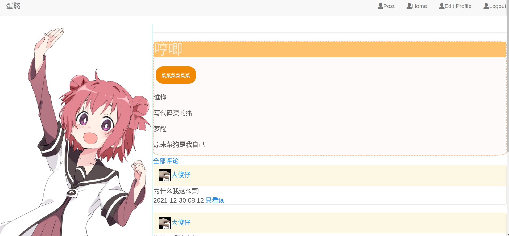

# flasklearn-secretsapce
学习flask的练手。计划写一个~~情侣空间~~ 在线论坛

## 安装
首先保证环境有python3,然后运行以下命令
`pip install -r requirements.txt`

## 运行
`flask run --reload`

## 预览

- 文章页面

  

## 功能介绍

1. 帖子

    - 发帖
    - 编辑
    - 删除

2. 用户个人页面支持
    - 头像
    - 签名
    - 历史文章

3. 帖子回复

     

### Todo

- [x] 头像bug修复

- [x] 帖子编辑/删除

- [x] 留言删除

- [x] 只看ta功能

- [ ] 帖子标签 - 正在进行中

- [ ] 以标签查看

- [ ] 邮箱审核

- [ ] 管理功能

- [ ] 表情包

  

  

## 扩展

### Editormd
~~editormd包请自行去官方查找部署于static/editormd下~~    现已一起push到仓库中了
教程参考:https://www.cdxy.me/?p=719
